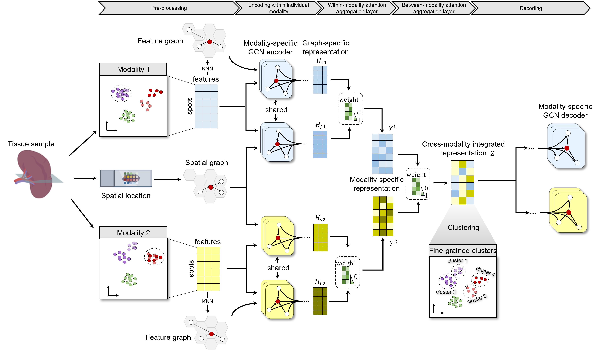

Welcome to SpatialGlue's documentation!
========================================

.. SpatialGlue documentation master file, created by
   sphinx-quickstart on Thu Sep 16 19:43:51 2021.
   You can adapt this file completely to your liking, but it should at least
   contain the root `toctree` directive.

Integrated analysis of spatial multi-omics with SpatialGlue
=====================================================================================================================================================

.. toctree::
   :maxdepth: 1
   
   ./source/Installation
   ./source/Tutorial 1_data integration for mouse spleen SPOTS.ipynb
   ./source/Tutorial 2_data integration for mouse thymus Stereo-CITE-seq.ipynb
   ./source/Tutorial 3_data integration for mouse brain Spatial-ATAC-RNA-seq.ipynb

Overview
========
SpatialGlue is a novel deep learning method for integrating spatial multi-omics data in a spatially informed manner. It utilizes a cycle graph neural network with a dual-attention mechanism to learn the significance of each modality at cross-omics and intra-omics integration. The method can accurately aggregate cell types or cell states at a higher resolution on different tissue types and technology platforms. Besides, it can provide interpretable insights into cross-modality spatial correlations. SpatialGlue is computationally efficient and it only requires about 5 mins for spatial multi-omics data at single-cell resolution (e.g., Spatial-ATAC-RNA-seq data, ~10,000 spots).

Citation
========
Yahui Long, Kok Siong Ang, Sha Liao, Raman Sethi, Yang Heng, Chengwei Zhong, Hang Xu, Nazihah Husna, Min Jian, Lai Guan Ng, Ao Chen, Nicholas RJ Gascoigne, Xun Xu, Jinmiao Chen. Integrated analysis of spatial multi-omics with SpatialGlue. bioRxiv. 2023.
