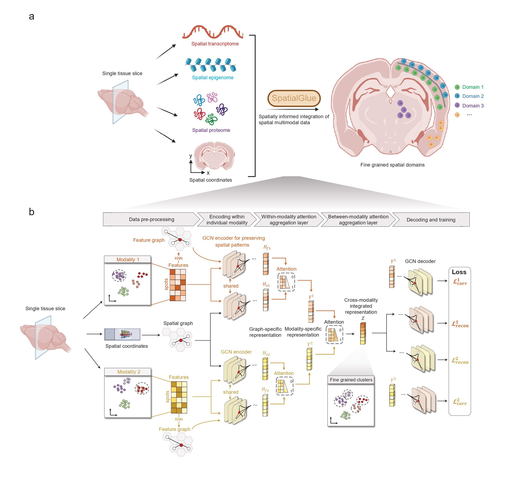

Welcome to SpatialGlue's documentation!
========================================

.. SpatialGlue documentation master file, created by
   sphinx-quickstart on Thu Sep 16 19:43:51 2021.
   You can adapt this file completely to your liking, but it should at least
   contain the root `toctree` directive.

Deciphering spatial domains from spatial multi-omics with SpatialGlue 
=====================================================================================================================================================

.. toctree::
   :maxdepth: 1
   :caption: Contents:
   
   Installation
   Tutorial 1_data integration for human lymph node (10x Genomics Visium, in-house data)
   Tutorial 2_data integration for mouse thymus Stereo-CITE-seq
   Tutorial 3_data integration for mouse spleen SPOTS
   Tutorial 4_data integration for mouse brain Spatial-epigenome-transcriptome
   Tutorial 5_data integration for triplet omics data (Simulation)

Overview
========
Integration of multiple data modalities in a spatially informed manner remains an unmet need for exploiting spatial multi-omics data. Here, we introduce SpatialGlue, a novel graph neural network with dual-attention mechanism, to decipher spatial domains by intra-omics integration of spatial location and omics measurement followed by cross-omics integration. We demonstrate that SpatialGlue can more accurately resolve spatial domains at a higher resolution across different tissue types and technology platforms, to enable biological insights into cross-modality spatial correlations. SpatialGlue is computation resource efficient and can be applied for data from various spatial multi-omics technological platforms, including Spatial-epigenome-transcriptome, Stereo-CITE-seq, SPOTS, and 10x Visium. Next, we will extend SpatialGlue to more platforms, such as 10x Genomics Xenium and Nanostring CosMx. 

Citation
========
Yahui Long, Kok Siong Ang, Raman Sethi, Sha Liao, Yang Heng, Lynn van Olst, Shuchen Ye, Chengwei Zhong, Hang Xu, Di Zhang, Immanuel Kwok, Nazihah Husna, Min Jian, Lai Guan Ng, Ao Chen, Nicholas R. J. Gascoigne, David Gate, Rong Fan, Xun Xu & Jinmiao Chen. Deciphering spatial domains from spatial multi-omics with SpatialGlue. **Nature Methods**. 2024.
